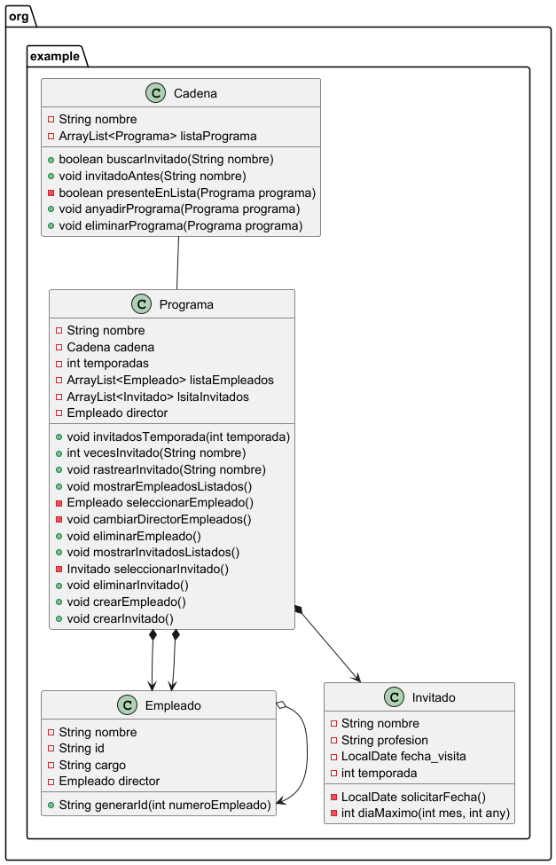
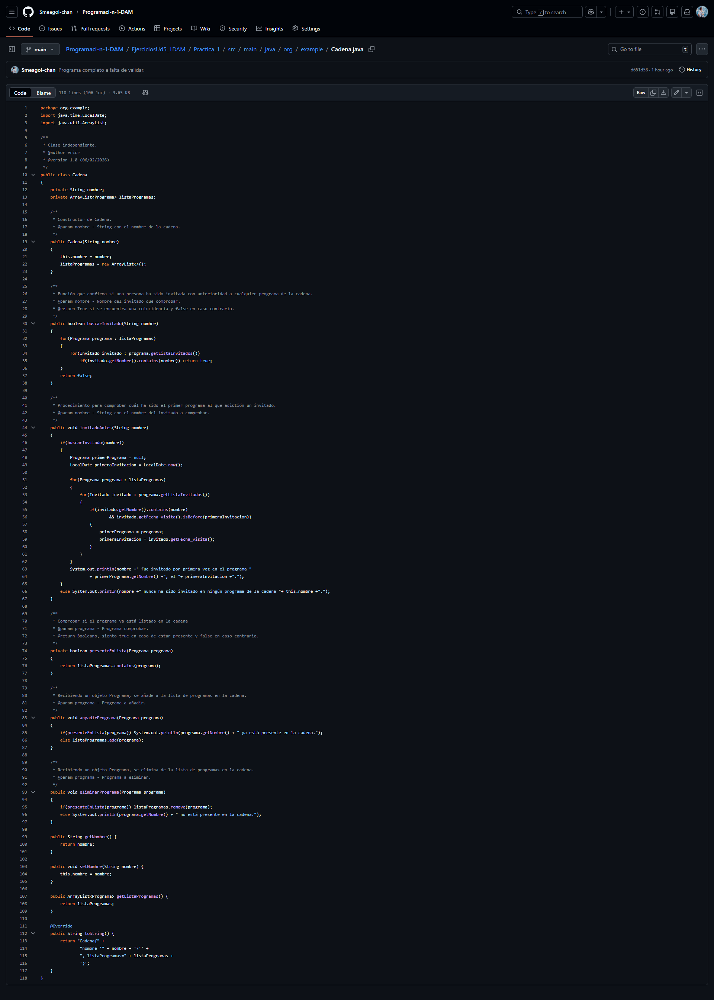
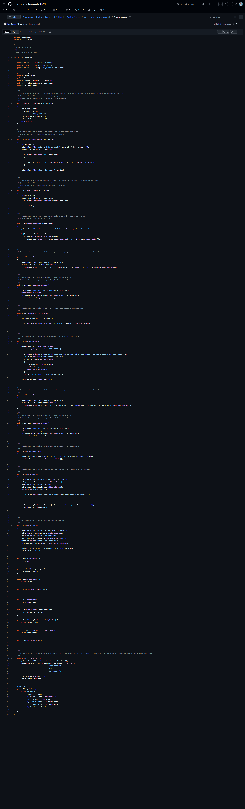
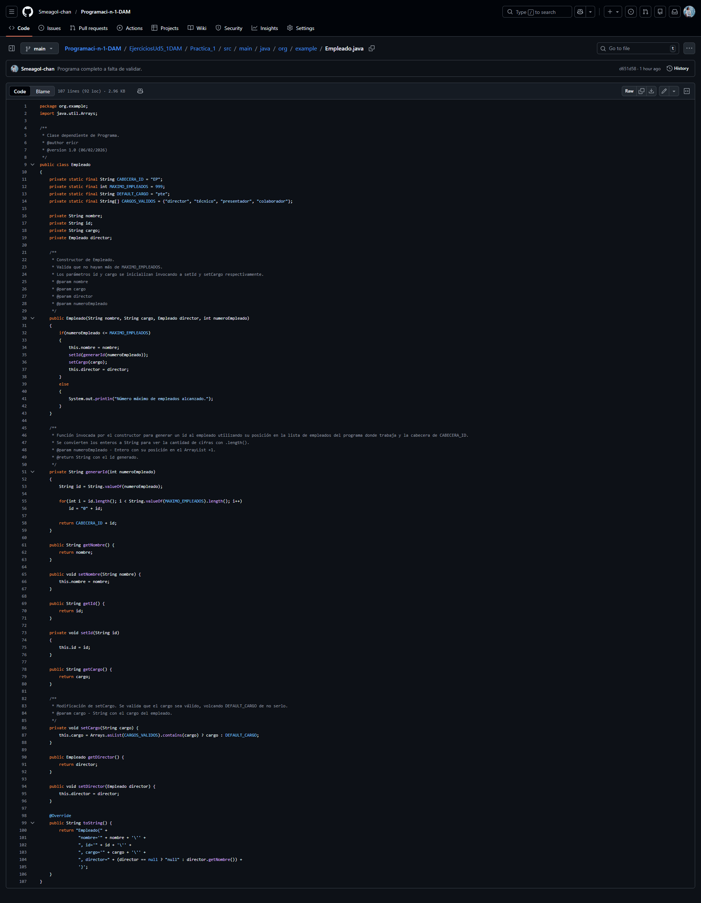
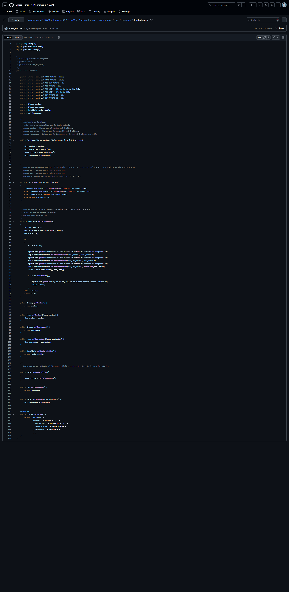
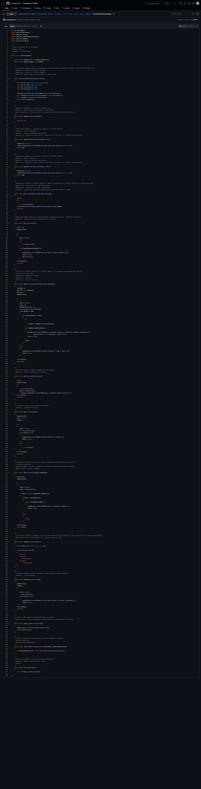
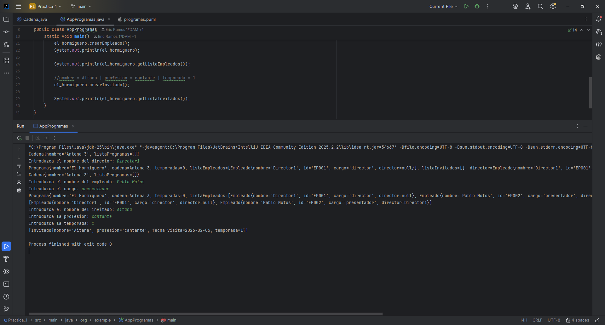
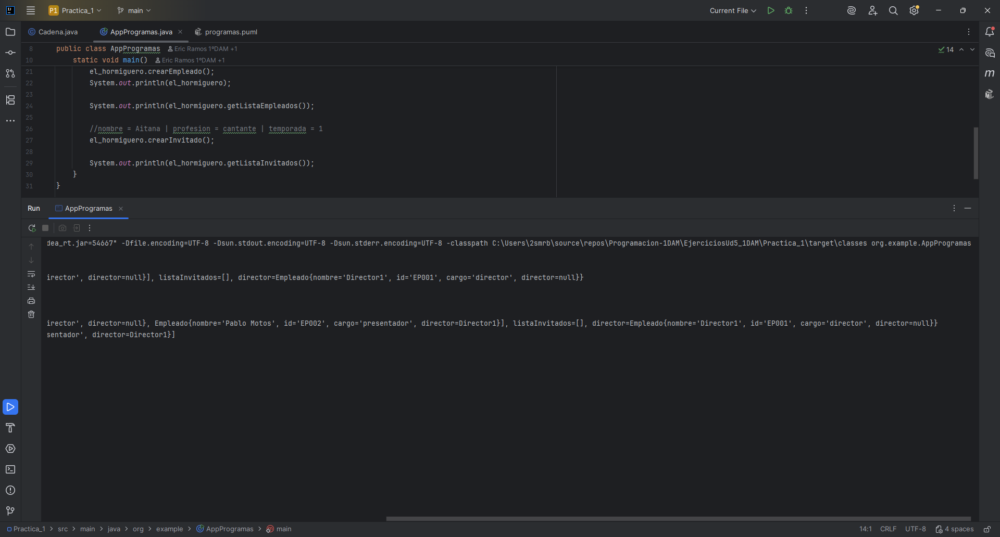

# Práctica 1: El Formiguero contra La Rebelión

## Índice
1. [Intro](#1-intro)
2. [Estructura de clases](#2-estructura-de-clases)
3. [Programa principal](#3-programa-principal)
4. [Pruebas](#4-pruebas)

## 1. Intro

    El mundo de la televisión últimamente parece estar en guerra. Algunos “se rebelan” contra otros, en
    directo, los otros desmienten las informaciones… Y los telespectadores, lejos de analizarlo de forma
    crítica, se hacen palomitas para ver según qué programa en función de su ideología.

    Jordi está harto de la división entre “las dos Españas”, y decide intentar poner un poco de paz creando
    una aplicación que recoja datos diarios sobre estos programas para dar objetividad a las distintas
    informaciones que van apareciendo. 

### 1.1. Problema a resolver

Se pide que se creen cuatro clases para almacenar la información de los programas que cada cadena de televisión pueda contener, junto con el diagrama UML correspondiente. Las clases son:
- Cadena
- Programa
- Empleado
- Invitado

Además, he introducido la clase _FuncionesComunes_ para ayudar en la resolución del problema.

## 2. Estructura de clases
### 2.1. Diagrama UML - Imagen

#### 2.2. Diagrama UML - Código de PlantUML
<code>
@startuml

package "org.example" {

    Class Cadena {
        - String nombre
        - ArrayList<Programa> listaPrograma

        + boolean buscarInvitado(String nombre)
        + void invitadoAntes(String nombre)
        - boolean presenteEnLista(Programa programa)
        + void anyadirPrograma(Programa programa)
        + void eliminarPrograma(Programa programa)
    }

    Class Programa {
        - String nombre
        - Cadena cadena
        - int temporadas
        - ArrayList<Empleado> listaEmpleados
        - ArrayList<Invitado> lsitaInvitados
        - Empleado director

        + void invitadosTemporada(int temporada)
        + int vecesInvitado(String nombre)
        + void rastrearInvitado(String nombre)
        + void mostrarEmpleadosListados()
        - Empleado seleccionarEmpleado()
        - void cambiarDirectorEmpleados()
        + void eliminarEmpleado()
        + void mostrarInvitadosListados()
        - Invitado seleccionarInvitado()
        + void eliminarInvitado()
        + void crearEmpleado()
        + void crearInvitado()
    }

    Class Empleado {
        - String nombre
        - String id
        - String cargo
        - Empleado director

        + String generarId(int numeroEmpleado)
    }

    Class Invitado {
        - String nombre
        - String profesion
        - LocalDate fecha_visita
        - int temporada

        - LocalDate solicitarFecha()
        - int diaMaximo(int mes, int any)
    }

    Cadena -- Programa
    Programa *--> Empleado
    Programa *--> Empleado
    Empleado o--> Empleado
    Programa *--> Invitado
}

@enduml
</code>
## 3. Programa principal
Para una explicación detallada de cada método en el programa, puede acceder al Javadoc pinchando [aquí](javadoc/Javadoc_AppPrograma.zip).

### 3.1 AppPrograma - [link](src/main/java/org/example/AppProgramas.java)

### 3.2 Cadena - [link](src/main/java/org/example/Cadena.java)

### 3.3 Programa - [link](src/main/java/org/example/Programa.java)

### 3.4 Empleado - [link](src/main/java/org/example/Empleado.java)

### 3.5 Invitado - [link](src/main/java/org/example/Invitado.java)

### 3.6 FuncionesComunes - [link](src/main/java/org/example/FuncionesComunes.java)

## 4. Pruebas
- Prueba de mi programa con el main proporcionado por Patri:

