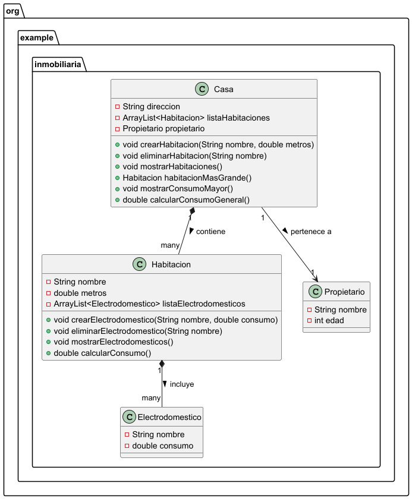

# Práctica 1: El Formiguero contra La Rebelión

## Índice
1. [Intro](#1-intro)
2. [Estructura de clases](#2-estructura-de-clases)
3. [Programa principal](#3-programa-principal)
4. [Pruebas](#4-pruebas)
5. [Entregas](#5-entregas)

### 1. Intro
> La práctica consiste en...

### 2. Estructura de clases

#### Código de PlantUML
<code>
@startuml

package "org.example.inmobiliaria" {

    class Casa {
        - String direccion
        - ArrayList<Habitacion> listaHabitaciones
        - Propietario propietario

        + void crearHabitacion(String nombre, double metros)
        + void eliminarHabitacion(String nombre)
        + void mostrarHabitaciones()
        + Habitacion habitacionMasGrande()
        + void mostrarConsumoMayor()
        + double calcularConsumoGeneral()
    }

    class Habitacion {
        - String nombre
        - double metros
        - ArrayList<Electrodomestico> listaElectrodomesticos

        + void crearElectrodomestico(String nombre, double consumo)
        + void eliminarElectrodomestico(String nombre)
        + void mostrarElectrodomesticos()
        + double calcularConsumo()
    }

    class Electrodomestico {
        - String nombre
        - double consumo
    }

    class Propietario {
        - String nombre
        - int edad
    }

    Casa "1" *-- "many" Habitacion : contiene >
    Habitacion "1" *-- "many" Electrodomestico : incluye >
    Casa "1" --> "1" Propietario : pertenece a >
}

@enduml
</code>
### 3. Programa principal

### 4. Pruebas

### 5. Entregas
- [X] Código fuente en GitHub
- [X] Documentación
- [ ] Pruebas
