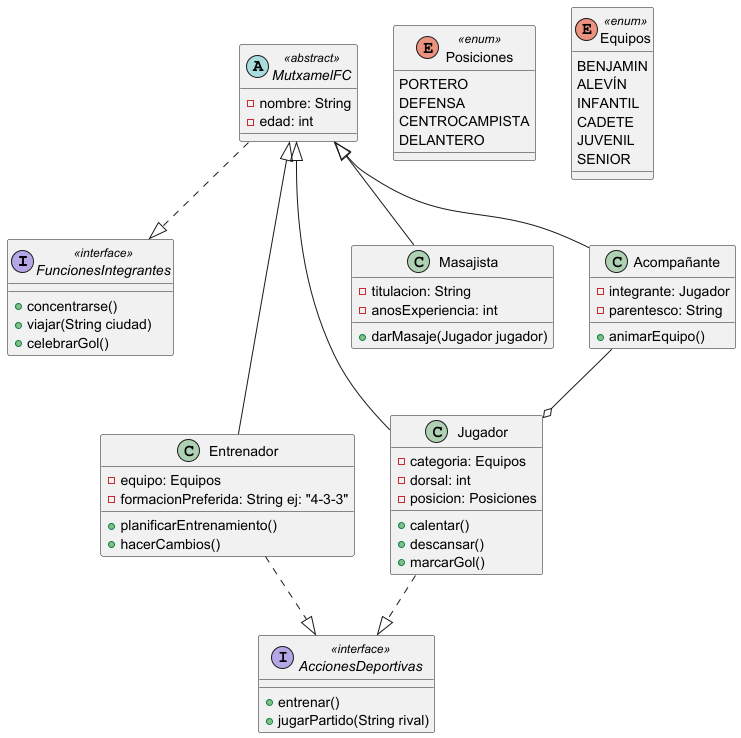
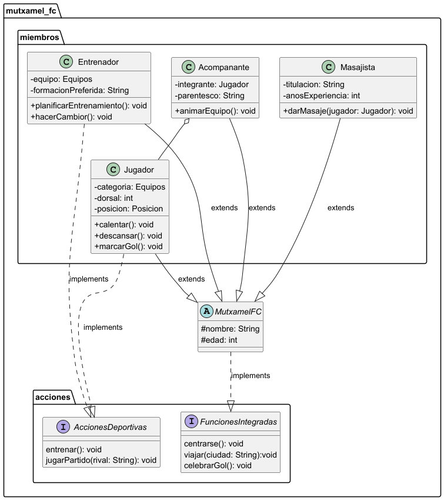

# Práctica 1: Sistema de pago para un e-commerce

## Índice
1. [Intro](#1-intro)
  1.1. [Problema a resolver](#11-problema-a-resolver)
2. [Estructura de clases](#2-estructura-de-clases)
  2.1. [UML](#21-uml)
3. [Programa](#3-programa)
  3.1. [AppMutxamel](#31-appmutxamel)
  3.2. [Mantenimiento](#32-mantenimiento)
  3.3. [Miembros](#33-miembros)
  3.4. [Enums](#34-enums)
  3.5. [Excepciones](#35-excepciones)
  3.6. [Acciones](#36-acciones)
  3.7. [AccionesMiembros](#37-accionesmiembros)
  3.8. [FuncionesComunes](#38-funcionescomunes)
5. [Prueba de errores](#4-prueba-de-errores)

## 1. Intro

El azar ha hecho que al MUTXAMEL FC le toque el Real Madrid en las primeras rondas de la Copa del Rey. Por eso, el club ha emitido un comunicado para contar que va a
empezar un proceso de modernización en cuanto a su organización para que no parezca que sea un “equipillo” cualquiera, y ver si así la visita al Bernabéu hace que
Florentino se interese un poco por ellos.

### 1.1. Problema a resolver

Se pide implementar las funcionalidades del diagrama UML dado:

## 2. Estructura de clases

El diagrama de clases que estructora el programa se ha realizado en PlantUML.

### 2.1. UML

A continuación se muestra el diagrama UML. Para ver el código en PlantUML pinche [aquí](src/main/java/org/example/MutxamelFC.puml).  

## 3. Programa

El programa consiste en cinco clases (una abstracta y el resto comunes) encargadas de construir los objetos, dos enums, excepciones cinco personalizadas y una clase que alberga toda la funcionalidad.

Para ver una descripción en detalle de cada método presente en el programa, acceda al [JavaDoc](javadoc.zip).

### 3.1. AppMutxamel - [código](src/main/java/org/example/AppMutxamel.java)

Clase que alberga el método main().  
Invoca al procedimiento para inicializar la lista de miembros del club y al menú principal del programa.

### 3.2. Mantenimiento - [código](src/main/java/org/example/muxtamel_fc/Mantenimiento.java)

Clase encargada de la funcionalidad del programa. Almacena todos los menús, solicita los datos al usuario e invoca a las funciones pertinentes.  
Le añadí una opción al menú principal para poder ejecutar todas las acciones que el primer main() del pdf muestra.

### 3.3. Miembros - [paquete](src/main/java/org/example/muxtamel_fc/miembros/)

Paquete con las clases de los objetos del programa:
- **MutxamelFC**: Superclase abstracta de la que se extienden el resto.
- **Entrenador**: Clase hija. Ha de controlar que el formato de formación sea corracto.
- **Jugador**: Clase hija. Ha de controlar que no se repitan dorsales para el mismo equipo.
- **Masajista**: Clase hija. No tiene ninguna peculiaridad.
- **Acompanante**: Clase hija. Contrae una relación de agregación con Jugador.

### 3.4. Enums - [paquete](src/main/java/org/example/muxtamel_fc/enums/)

Paquete que contiene los dos enums empleados para la práctica:
- **Equipos**: Lista las divisiones del club.
- **Posiciones**: Lista las posiciones de los jugadores.

### 3.5. Acciones - [paquete](src/main/java/org/example/muxtamel_fc/acciones/)

Paquete que almacena las dos interfaces del proyecto:
- **FuncionesIntegradas**: Implementada por MutxamelFC, permitiendo viajar, concentrarse y celebrar un gol tanto a ella como a sus hijas.
- **AccionesDeportivas**: Implementada por Jugador y Entrenador, permitiendo descansar y jugar un partido.

### 3.6. Excepciones - [paquete](src/main/java/org/example/muxtamel_fc/excepciones/)

Paquete que guarda las excepciones personalizadas:
- **AcompananteDuplicadoException**: En caso de tratar de añadir a un acompañante ya existente.
- **DorsalDuplicadoException**: En caso de haber dorsales duplicados dentro del mismo equipo.
- **IllegalFormateException**: En caso de introducir un formato de formación inválido.
- **MasajistaDuplicadoException**: En caso de tratar de añadir a un masajista ya existente.
- **EntrenadorDuplicadoException**: En caso de añadir un entrenado a un equipo con otro ya asignado.

### 3.7. AccionesMiembros - [código](src/main/java/org/example/muxtamel_fc/AccionesMiembros.java)

Clase con las acciones a realizar ordenadas presentes en el primer main de ejemplo del pdf de la Práctica 2. El que está lleno de comentarios describiendo el proceso.

### 3.8. FuncionesComunes - [código](src/main/java/org/example/FuncionesComunes.java)

Clase que contiene métodos de uso común en las prácticas y ejercicios que se han ido realizando desde inicio de curso. Para esta práctica se ha empleado para solicitar números, chars y Strings al usuario.

## 4. Prueba de errores

La prueba de errores se ha realizado con un vídeo explicativo.

